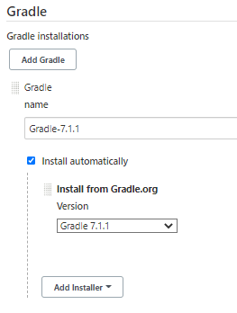
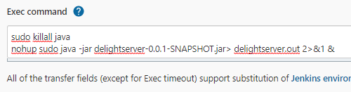

# simpleJenkinsGuide

이 repository 는 jenkins 의 기능 중 github push 에서부터 CI/CD 까지 구성하는    
것을 기록으로 남기는 목적을 갖고 있습니다.    
java, AWS 를 이용합니다.   

### Jenkins 란 무엇인가?
  * CI/CD 를 도와주는 tool 입니다.   
  * 보통 Master/Slave machine 으로 구성되에 Master 에    
    Jenkins 가 돌아가며 github 에서 project 를 받아 build 하여    
    완성본을 Slave 에 옮겨 실행시키는 역활을 합니다.   
  * Jenkins 는 [City](https://en.wikipedia.org/wiki/City_(novel)) 라는 소설의 
    로봇 집사 이름입니다.   
    
### 따라하며 배우는 Jenkins

  <details>
  <summary>
  Jenkins 실행시키기   
  </summary>
  <br>

  * [EC2를 고르실 때 최소한 2GB 메모리가 있는 머신을 골라주세요.](https://stackoverflow.com/questions/57991172/aws-ec2-t2-micro-unlimited-jenkins-maven-very-slow-build-hangs)    
    <br>
  
  * 급하시면 jenkins-ec2-installer.sh 가 있습니다.   
    Jenkins 설정 부분에서 이어서 하시면 됩니다.   
    ubuntu, ec2 전용입니다.   
    <br>
  
  * 기초공사를 합니다.
    ```
    sudo apt update
    sudo apt -y upgrade
    ```   
    <br>
  
  * Jenkins 의 경우 jdk 를 사용합니다.
    ```
    sudo apt -y install openjdk-8-jdk
    ```   
    <br>
  
  * Jenkins 를 설치합니다.
    ```
    wget -q -O - https://pkg.jenkins.io/debian-stable/jenkins.io.key | sudo apt-key add -
    echo "deb https://pkg.jenkins.io/debian-stable binary/" >> /etc/apt/sources.list
    sudo apt update
    sudo apt install jenkins -y
    ```
    이 설치방법은 ec2 ubuntu 에 해당됩니다.   
    다른 설치 방법들은 [여기](https://www.jenkins.io/doc/book/installing/) 를 참고하세요.   
    2번째 줄은 /etc/apt/sources.list 에 글을 작성하는 코드입니다.   
    해당 코드로 Jenkins 는 update,install 이 가능하게 됩니다.     
    <br>
  
  * Jenkins 를 시작합니다.
    ```
    sudo systemctl start jenkins
    sudo systemctl enable jenkins
    ```   
    <br>
  
  * Jenkins 비밀번호를 표시합니다.
    ```
    echo The password for jenkins is :
    sudo cat /var/lib/jenkins/secrets/initialAdminPassword
    ```
    Jenkins 파일 위치의 /secrets/initialAdminPassword 위치에 있습니다.   
    운영체제, provider 에 따라 위치가 다를 수 있습니다.    
    곧 정확한 위치가 나옵니다. 안나온다면 스킵해주세요.   
    <br>
  
  * Jenkins 설치한 서버의 ip:8080 으로 들어갑니다.    
    <br>
  
  * 위 위 단계에서 cat 한 initialAdminPassword 를 입력해줍니다.   
    <br>
        
    만약 비번이 안나왔다면 화면에 나온 비번 주소를 다시 cat 해봅시다.   
    Jenkins 홈 주소도 잘 인지해주세요.   
    <br>
  
  * 권장 플러그인을 설치합니다.   
    <br>
  
  * 회원가입 합니다.    
  <br>
  </details>
  <br>

  <details>
  <summary>
  Slave machine 등록
  </summary>
  <br>

  * publish over ssh 플러그인 설치합니다.    
    Jenkins 관리 -> 플러그인 관리 -> 설치 가능 -> 검색 -> 재시작 없이 설치   
    <br>
       
    <br>
       
    <br>
       
    <br>
        
    <br>
  
  * Slave machine 등록    
    Slave machine 이 될 ec2 를 생성합니다.      
    SSH 포트를 마스터 ip 와 local ip 만 가능하게 열어둡니다.   
    나머지는 필요에 따라 설정하세요.      
    <br>
    다시 jenkins 로 돌아오셔서   
    <br>
         
    설정 화면에서 스크롤을 아래로 계속 하시다보면    
    <br>
        
    이 화면이 나옵니다. 추가를 클릭해주세요.    
    <br>
        
    이곳이 이제 slave machine 을 세팅하는 곳입니다.   
    <br>
    Name : 아무거나 넣어주세요. 구별 가능한게 좋습니다.   
    Hostname : slave 의 ip 를 넣어주세요.   
    Username : slave 에 ssh 에 사용되는 username 을 넣어주세요.   
    <br>
  
    참고    
    <br>
    AMI 별 username   
        
    <br>
    다 설정하셨다면 고급을 눌러줍니다.    
    <br>
  
       
    이 화면이 나오는데    
    <br>
    Use Password authentication or ... 를 체크합니다.   
    key 에 aws 에서 제공받은 slave 의 pem key 를 복붙합니다.      
    <br>
    Test Configuration 버튼을 클릭하여 연결을 확인합니다.   
    <br>
    연결이 다 되셨다면 위 방법을 반복하여 slave 를 더 추가하시고 저장 버튼을 누릅니다.       
    <br>
  
  </details>
  <br>

  <details>
  <summary>
  Gradle, Maven 설치
  </summary>
  <br>

  * Gradle, Maven 설치   
    Master 에서 build 를 하고 slave 로 넘겨주기 전 jar build 를 위한 설정입니다.     
    <br>
    Global tools configuration -> Gradle / Maven
       
    <br>
    gradle 의 경우   
    Install automatically -> Install from Gradle.org   
         
    <br>
    maven 의 경우   
    Install automatically -> Install from Apache      
        
    설정이 끝나시면 save 를 눌러주세요.   
    <br>
  </details>
  <br>

  <details>
  <summary>
  Jenkins 업데이트
  </summary>
  <br>

  * Jenkins 업데이트    
    Jenkins 가 업데이트 안되어 있을 때 gradle 과 maven 을 인식하지 못하는
    버그가 존재합니다.   
        
    플러그인 관리로 들어갑니다.    
    <br>
        
    고급을 눌러줍니다.   
    <br>
       
    지금 확인 버튼을 누르시면 jenkins 가 업데이트 됩니다.   
  <br>
  </details>
  <br>

  <details>
  <summary>
  아이템 생성
  </summary>
  <br>

  * 아이템 생성   
    Jenkins 아이템은 빌드의 한 단위라고 생각하시면 됩니다.   
    <br>
        
    메인화면에서 새로운 item 을 클릭합니다.   
    <br>
        
    item name 은 아무거나 입력해주시고 freestyle project 를 눌러주세요.      
    (욕심이 더 있으시다면 pipeline 도 알아보시면 좋습니다.)    
    (지금은 편의를 위해 freestyle 로 하겠습니다.)    
    <br>
  * Github 설정    
           
    push 되면 deploy 될 github 의 .git 주소를 복사합니다.
    <br>
        
    여기에서 .git 으로 끝난다는 점을 유의하세요.   
    가져와서 build 할 branch 설정도 가능합니다.    
    <br>
        
    빌드 유발에 GITScm 도 체크해주세요.    
    <br>
       
    다시 github 로 돌아와주셔서 다음 단계를 따르시면 됩니다.   
    여기에서 Payload URL 에    
    http://본인masterIp주소:8080/github-webhook/   
    로 해주시면 됩니다.   
    <br>
  </details>
  <br>

  <details>
  <summary>
  아이템 master build 설정
  </summary>
  <br>

  * Add Build Step   
    이 단계는 master 에서 github 프로젝트에서 파일을 받아
    build 를 하는 단계입니다.   
       
    본인의 프로젝트에 따라 골라주세요.    
    <br>
  
    gradle 의 경우   
       
    버전을 골라주시고 clean build 해주세요.    
    <br>
  
    maven 의 경우   
       
    명령어가 clean install 로 다릅니다.    
    <br>
  
    추가적인 gradle 이나 maven command 는 윈하시는대로 더 넣어주시면 됩니다.   
    <br>
  
  * 빌드 후 조치 추가   
    이 단계는 master 에서 빌드가 완료된 이후에 slave 에게
    조치를 취하는 단계입니다.   
        
    <br>
  
    여기서부터 빡집중 부탁드립니다.   
    <br>
    위에서 인지해두라고 했던   
    Jenkins home directory 기억 나시나요?   
    <br>
       
    저는 workspace 에 work 라는 파일이 있는데,   
    여러분은 아직 아무런 파일이 없을 것입니다.   
    <br>
    이 work 라는 파일명은      
       
    위에서 만든 item name 입니다.   
    <br>
    이 안에 들어가보면   
       
    repository 의 파일이 있습니다.   
    여러분도 빌드가 실행되면 이렇게 파일이 master 에 생깁니다.   
    <br>
    이 프로젝트에서의 transfer 설정은   
       
    다음과 같습니다.   
    <br>
    Source files 가 시작하는 위치가   
    var/lib/jenkins/workspace/지정하신 워크명/   
    이라는 것에 유의해주세요.   
    <br>
    remove prefix 는 파일경로를 만드는 것을 방지해줍니다.   
    <br>
    그냥 코드만 알려주지 이걸 왜 이렇게 강조하냐 하면...      
    <br>
    Jenkins file transfer 는 매우 유용하기 때문입니다.   
    꼭 jar 파일만 보낼 필요는 없죠.   
    이미지, 파일, html 등 필요한걸 보내실 수 있어야 합니다.   
    <br>
  </details>
  <br>
  
  <details>
  <summary>
  아이템 slave command 설정
  </summary>
  <br>

  * Execute Command   
    마지막으로 Exec command 에 slave 가 수행할 명령을 적습니다.       
    <br>
         
    (aws ubuntu의 경우)   
    slave 명령의 수행 위치는 /home/ubuntu 입니다.   
    <br>
    `> delightserver.out 2>&1 &` 의 이유는   
    nohup 이후에 enter 를 칠 필요가 없게 만들어서 jenkins 진행을 돕고      
    delightserver.out 이라는 파일에 무시되는 화면을 저장하기 위해서입니다.   
    <br>
    이제 마지막으로 저장하시고...
  
           
    Build Now 를 눌러주시면...
  
    <br>
  
    두구두구두구두구.....    
    <br>
        
    성공!    
    <br>
       
    Build 번호를 눌러보시면 console Output 을 확인하실 수 있습니다.
  </details>
  <br>